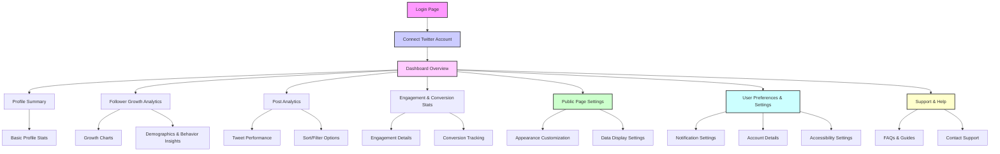

# Echosight User Journey Workflow 🚀

## Introduction 📝

Welcome to the definitive guide for the Echosight user journey. This document 📄 is crafted to serve as the single source of truth 🧭 for understanding how users interact with the Echosight platform, from their initial visit 🌐 to their active engagement with the analytics dashboard 📊. Each step of the journey is broken down into detailed segments, shedding light on user actions and system responses. This guide will aid developers 💻, product managers 🕴️, and support teams 🤝 in visualizing the user experience and optimizing the workflow's design to ensure a seamless, intuitive, and empowering service for our users.

## Workflow Diagram 📈

```mermaid
graph TD
    A("Landing on echosight.io: User arrives at the homepage.") --> B("Create Account: User chooses to create a new account.")
    B --> C{"Account Creation Method: User selects a method to create an account."}
    C -->|Email| D("Sign up with Email: User provides email address and depending on how we do things, sets a password.")
    C -->|Twitter| E("Sign up with Twitter: User authorizes via Twitter, and their email is retrieved.")
    D --> F("Email Confirmation: System sends a confirmation or sign-in code via email.")
    E --> F
    F --> G("Access Dashboard: User gains access to the main dashboard upon confirmation.")
    G --> H{"Integration Added? User decides whether to integrate a Twitter account."}
    H -->|No| I("Add Integration: User is prompted to integrate a Twitter account to activate features.")
    H -->|Yes| J("Activate Public Page: User's public page is prepared for activation.")
    I --> J
    J --> K("Data Collection and URL Generation: System collects data from Twitter and generates a unique URL for the user's public page.")
    K --> L("Public Page Customization Options: User can customize their public page with available settings.")
    L --> M("User's Personal Dashboard: User views their personal dashboard displaying data and insights.")
    M --> N("Application Functionality: Standard functionalities such as user and account management are available.")
    N --> O{"Payment Required? System checks if the user needs to make a payment or has a coupon code."}
    O -->|Yes| P("Stripe Payment Integration: User completes payment through Stripe integration.")
    O -->|No/Coupon| Q("Activate Twitter Connection: User connects their Twitter account without payment.")
    P --> Q
    Q --> R("Account Fully Functional: User's account is now fully set up and functional.")
    R --> S("Public URL Provided for Sharing: User receives a public URL to share their public page.")
    S --> T("Optional Customization Settings: User can further customize their public page and settings.")

    style A fill:#fff,stroke:#333,stroke-width:2px,color:#333
    style B fill:#fff,stroke:#333,stroke-width:1px,color:#333
    style C fill:#fff,stroke:#333,stroke-width:1px,color:#333
    style D fill:#fff,stroke:#333,stroke-width:1px,color:#333
    style E fill:#fff,stroke:#333,stroke-width:1px,color:#333
    style F fill:#fff,stroke:#333,stroke-width:1px,color:#333
    style G fill:#fff,stroke:#333,stroke-width:1px,color:#333
    style H fill:#fff,stroke:#333,stroke-width:1px,color:#333
    style I fill:#fff,stroke:#333,stroke-width:1px,color:#333
    style J fill:#fff,stroke:#333,stroke-width:1px,color:#333
    style K fill:#fff,stroke:#333,stroke-width:1px,color:#333
    style L fill:#fff,stroke:#333,stroke-width:1px,color:#333
    style M fill:#fff,stroke:#333,stroke-width:1px,color:#333
    style N fill:#fff,stroke:#333,stroke-width:1px,color:#333
    style O fill:#fff,stroke:#333,stroke-width:1px,color:#333
    style P fill:#fff,stroke:#333,stroke-width:1px,color:#333
    style Q fill:#fff,stroke:#333,stroke-width:1px,color:#333
    style R fill:#fff,stroke:#333,stroke-width:1px,color:#333
    style S fill:#fff,stroke:#333,stroke-width:1px,color:#333
    style T fill:#fff,stroke:#333,stroke-width:1px,color:#333
```

> **Note**: *The email confirmation process is designed to be flexible, with the option to use a magic link or a sign-in code. The diagram above depicts the sign-in code option. We should only implement this if it is a quick and easy addition. Otherwise, we can stick with the traditional email confirmation process.

## Detailed User Journey Breakdown 🔍

### 1. Landing on echosight.io

- **What Happens**: Users arrive at the Echosight homepage 🏠 where they are greeted with an enticing overview of the services offered.
- **Behind the Scenes**: The landing page is crafted to be responsive, accessible, and optimized for various devices and browsers 🖥️📱.

### 2. Account Creation Process

* **What Happens**: Users arrive at a crossroads where they must decide how to establish their Echosight identity. They have the choice to register using their email address 📧, offering a familiar approach, or to leverage their Twitter/X account 🐦 for a quicker, social media-integrated experience.
* **Behind the Scenes**: The platform employs Devise with Omniauth to weave a secure tapestry of authentication processes. This robust framework not only fortifies the sign-up procedure but also anchors the user's identity to their email address, establishing it as a pivotal point of reference within the Echosight ecosystem 🔐.

### 3. Email Signup

* **What Happens**: In the realm of email signup, users are invited to enter the gateway to Echosight with just their email address – no traditional password needed. Instead, a magic link or a time-sensitive sign-in code is dispatched to their inbox 💌, which upon their click, grants them entry into their new account. This modern take on account access emphasizes ease and efficiency, letting users bypass the often cumbersome step of creating and remembering a new password 🔑.
* **Behind the Scenes**: When a user opts for this route, the system generates a unique, one-time-use token, encapsulated within the link or code sent to the user's email. This token is a cryptographic handshake between the user and the platform, ensuring that only the person with access to that email can unlock their Echosight account. The token's ephemeral nature boosts security, as it loses its power after use or after a short period, whichever comes first. This process is engineered to mesh seamlessly with the user's experience, harmonizing security with convenience ✉️.

### 4. Twitter/X Signup

- **What Happens**: With Twitter/X signup, users authorize through Twitter/X, and their email is retrieved automatically after authorization 🔄.
- **Behind the Scenes**: Twitter/X API is used to securely fetch user details, streamlining the signup 🛠️.

### 5. Dashboard Access

- **What Happens**: Post-confirmation, users gain access to the Echosight dashboard 📋, their command center for data and insights.
- **Behind the Scenes**: The dashboard provides a comprehensive view of analytics pulled from the Twitter/X integration.

### 6. Integration Check

- **What Happens**: Users are guided to add a Twitter/X account integration to unlock the dashboard's full features 🔓.
- **Behind the Scenes**: Checks are in place for existing integrations, with prompts for setup if needed.

### 7. Public Page Activation

- **What Happens**: After integration, the user's public page is activated, including data collection and URL generation 🌐.
- **Behind the Scenes**: Data is collected via Twitter/X API, and a unique URL is generated for the user's public analytics page 📌.

### 8. Payment Process

- **What Happens**: The system checks for payment requirements before Twitter/X integration. Users either complete a transaction through Stripe 💳 or enter a coupon code 🎟️.
- **Behind the Scenes**: Secure payment processing is handled via Stripe, with coupon code application if available.

### 9. Finalizing Account Setup

- **What Happens**: Once the Twitter/X account is connected and payment is sorted, the account becomes fully functional ✅. A public URL for sharing the analytics page is provided to the user.
- **Behind the Scenes**: The system finalizes setup, ensuring data accuracy and page shareability 📤.

### 10. Customization and Management

- **What Happens**: Users customize their public page and manage their account, with the option to add multiple Twitter/X accounts if managing different entities 🔄.
- **Behind the Scenes**: The platform allows extensive customization and scalability, catering to diverse user needs.

## Conclusion 🎉

The detailed flowchart and breakdown provide a vivid and comprehensive view of the Echosight user journey 🛤️. It outlines not just the sequence of interactions but also the functionalities and systems operating backstage. This document is designed to guide the development of Echosight, ensuring that our team delivers a user-centric, robust, and intuitive experience that empowers our users through insightful analytics 📈.

## Dashboard

This diagram visually represents the structure and navigation flow of the Echosight dashboard. It starts with the login page, leading to connecting the Twitter account, and then branches out into various analytics and settings sections. Each node represents a different page or section of the dashboard, with connections showing the typical flow or navigation path a user might take. The color-coding highlights different categories like settings, analytics, and support. This mockup is a basic representation and can be further detailed based on specific requirements and functionalities of the Echosight platform.