# Echosight User Journey Workflow

## Introduction

This document presents a flowchart of the user journey for Echosight, from initial landing on the website to the full activation and usage of the account. It outlines the steps a user takes, including account creation, integration with Twitter, and customization of their public page.

## Workflow Diagram

```mermaid
graph TD
    A("Landing on echosight.io: User arrives at the homepage.") --> B("Create Account: User chooses to create a new account.")
    B --> C{"Account Creation Method: User selects a method to create an account."}
    C -->|Email| D("Sign up with Email: User provides email address and optionally, sets a password.")
    C -->|Twitter| E("Sign up with Twitter: User authorizes via Twitter, and their email is retrieved.")
    D --> F("Email Confirmation: System sends a confirmation or sign-in code via email.")
    E --> F
    F --> G("Access Dashboard: User gains access to the main dashboard upon confirmation.")
    G --> H{"Integration Added? User decides whether to integrate a Twitter account."}
    H -->|No| I("Add Integration: User is prompted to integrate a Twitter account to activate features.")
    H -->|Yes| J("Activate Public Page: User's public page is prepared for activation.")
    I --> J
    J --> K("Data Collection and URL Generation: System collects data from Twitter and generates a unique URL for the user's public page.")
    K --> L("Public Page Customization Options: User can customize their public page with available settings.")
    L --> M("User's Personal Dashboard: User views their personal dashboard displaying data and insights.")
    M --> N("Application Functionality: Standard functionalities such as user and account management are available.")
    N --> O{"Payment Required? System checks if the user needs to make a payment or has a coupon code."}
    O -->|Yes| P("Stripe Payment Integration: User completes payment through Stripe integration.")
    O -->|No/Coupon| Q("Activate Twitter Connection: User connects their Twitter account without payment.")
    P --> Q
    Q --> R("Account Fully Functional: User's account is now fully set up and functional.")
    R --> S("Public URL Provided for Sharing: User receives a public URL to share their public page.")
    S --> T("Optional Customization Settings: User can further customize their public page and settings.")

    style A fill:#fff,stroke:#333,stroke-width:2px,color:#333
    style B fill:#fff,stroke:#333,stroke-width:1px,color:#333
    style C fill:#fff,stroke:#333,stroke-width:1px,color:#333
    style D fill:#fff,stroke:#333,stroke-width:1px,color:#333
    style E fill:#fff,stroke:#333,stroke-width:1px,color:#333
    style F fill:#fff,stroke:#333,stroke-width:1px,color:#333
    style G fill:#fff,stroke:#333,stroke-width:1px,color:#333
    style H fill:#fff,stroke:#333,stroke-width:1px,color:#333
    style I fill:#fff,stroke:#333,stroke-width:1px,color:#333
    style J fill:#fff,stroke:#333,stroke-width:1px,color:#333
    style K fill:#fff,stroke:#333,stroke-width:1px,color:#333
    style L fill:#fff,stroke:#333,stroke-width:1px,color:#333
    style M fill:#fff,stroke:#333,stroke-width:1px,color:#333
    style N fill:#fff,stroke:#333,stroke-width:1px,color:#333
    style O fill:#fff,stroke:#333,stroke-width:1px,color:#333
    style P fill:#fff,stroke:#333,stroke-width:1px,color:#333
    style Q fill:#fff,stroke:#333,stroke-width:1px,color:#333
    style R fill:#fff,stroke:#333,stroke-width:1px,color:#333
    style S fill:#fff,stroke:#333,stroke-width:1px,color:#333
    style T fill:#fff,stroke:#333,stroke-width:1px,color:#333
```

## Conclusion

The flowchart above provides a clear visual representation of the steps involved in a user's journey with Echosight. This diagram is an essential tool for understanding the user experience and can be used to guide development and user support strategies.
